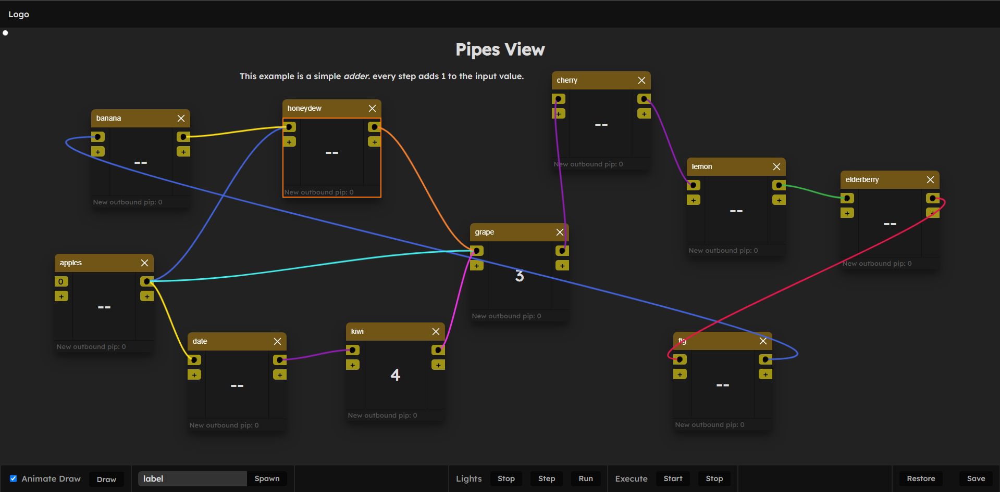

# Pipe view.

## Overview

Pipe view is a visual graph of windows. It allows you to connect windows together with pipes, and execute them in a sequence.

Under the hood we currently use winbox for the windows, and petite vue for the UI. The pipes are drawn on a canvas layer.

## Update 0.1

It works great.

- Pipes connected through the view, drag drop connections
- zoomable and draggable
- mini wrap of windows with vue js
- Step execution through simple execute/step process.
- Execute highlight: To show what's running.

### UI Choices:

- pipes is a canvas layer drawing node to node
- Zooming is managed independently
- The view is WinBox

I thought winbox would be super useful here as I really like the libraryy. However I quickly noticed it's more than I need. I will replace it with a simple div with absolute positioning. This will allow me to have more control over the UI and remove unnecessary features.

### Next Steps

Now refactored I will implement missing features

- Back/fore pipe draw swap: The canvas currently runs one layer - we want more than one.
    - and also an animate layer
- Rewrite the graph executor: The existing logic is a bit messy and doesn't handle all cases well.

### Links

- winbox: https://nextapps-de.github.io/winbox/
- petite vue: https://github.com/vuejs/petite-vue

---

## Old

### What is it:

A point to point graph of windows.

1. draggable divs.
2. HTML Content
3. Pull Points

Each panel has input and output nodes.

### Panel

A Panel is a window.js div. Has:

- header
- content
- tips
- locality.

### Nodes

A panel has pips as input or output nodes. By default _one_.
A node is connected to another using a line.

Considering an output, a many edges may connect to one node, and therefore messages are sent parallel.

Multiple pips can run in index, waiting for the first to resolve.

    [] ->

    ---

    [] ->
       ->

    ---

    [] ->
       ->
    [] ->

Same with input.

### Lines

The graph will be a dict, rendered lines with canvas for each point. probably bezier curves because they're easy